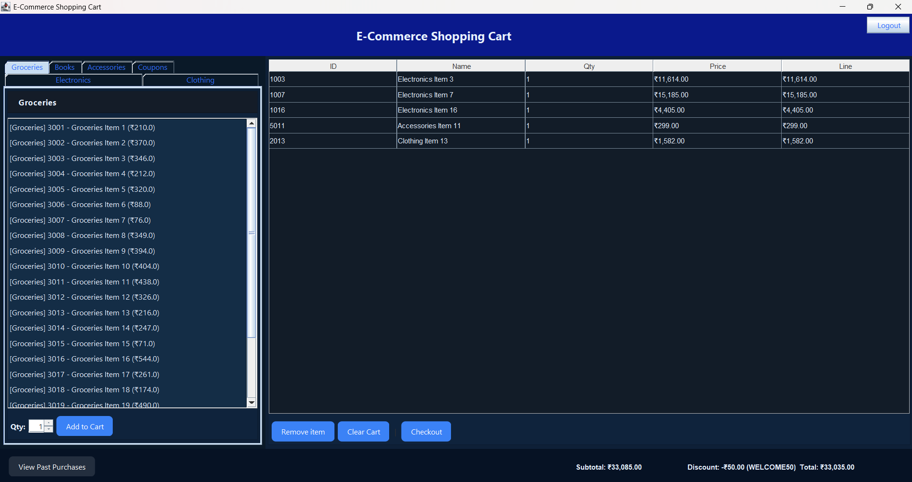

# 🛒 Shopping Cart Management System

A desktop-based **Shopping Cart Management System** developed using **Java Swing**. The application provides a modern graphical interface for browsing products, managing a shopping cart, applying coupons, and completing purchases while maintaining user accounts and order history.

---

## 🚀 Features

### 👤 User Authentication
- User Registration
- Secure Login
- Auto Login Support
- User Data Persistence

### 🛍️ Product Catalog
- Electronics
- Clothing
- Groceries
- Books
- Accessories
- Coupons

### 🛒 Shopping Cart
- Add Products to Cart
- Update Quantity
- Remove Products
- Clear Cart
- Automatic Price Calculation

### 💳 Checkout System
- Buy Now Option
- Checkout Summary
- Shipping Address
- Order Confirmation
- Coupon Discount Support

### 📜 Order History
- Save Purchase History
- View Previous Orders

### 🎨 Modern GUI
- Java Swing Interface
- Responsive Layout
- Category Tabs
- Custom Buttons
- Professional Theme

---

# 📸 Application Preview

<p align="center">
  
</p>

<p align="center">
  <em>Shopping Cart Management System built with Java Swing featuring user authentication, product categories, shopping cart, coupons, and checkout functionality.</em>
</p>


# 🛠️ Tech Stack

- Java
- Java Swing
- AWT
- Object-Oriented Programming (OOP)
- File Handling
- Collections Framework

---

# 📂 Project Structure

```
Shopping_Cart/
│
├── ShoppingCartApp.java
├── Product.java
├── User.java
├── Cart.java
├── Assets/
├── Images/
├── history/
└── README.md
```

---

# ✨ Key Features

- User Login & Registration
- Product Categories
- Shopping Cart Management
- Coupon System
- Buy Now Feature
- Checkout Summary
- Order History
- Persistent User Data
- Attractive Java Swing UI

---

# 🚀 Getting Started

## Clone Repository

```bash
git clone https://github.com/riyasachan94514/Shpping_Cart.git
```

## Navigate to Project

```bash
cd Shopping_Cart
```

## Compile

```bash
javac ShoppingCartApp.java
```

## Run

```bash
java ShoppingCartApp
```

---

# 📸 Screenshots

### Login Page

(Add Screenshot Here)

---

### Home Page

(Add Screenshot Here)

---

### Shopping Cart

(Add Screenshot Here)

---

### Checkout

(Add Screenshot Here)

---

# 📚 Learning Outcomes

- Java Swing GUI Development
- Object-Oriented Programming
- Event Handling
- File Handling
- Java Collections
- Desktop Application Development
- User Authentication
- Shopping Cart Logic

---

# 🔥 Future Enhancements

- MySQL Database Integration
- Online Payment Gateway
- Product Search
- Product Reviews
- Admin Dashboard
- Inventory Management
- Dark Mode
- PDF Invoice Generation

---

# 👩‍💻 Developer

**Riya Sacha**

- 🎓 AI & ML Student at NIET
- 💻 Software Engineer
- 🌐 Full Stack Developer
- ⚛️ MERN Stack Enthusiast
- 🧠 DSA Learner

**GitHub**
https://github.com/riyasachan94514

**LinkedIn**
https://www.linkedin.com/in/riya-sachan-714b2b33b/

---

## ⭐ Support

If you found this project useful, don't forget to give it a ⭐ on GitHub!

---

<p align="center">
Made with ❤️ using Java & Swing
</p>
